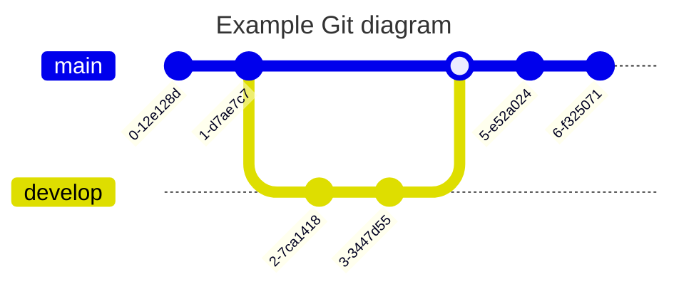

# weathering-travel
Weathering travel

## Environment setup
I want to use a virtual environment for this project to emulate the current [Databricks LTS Runtime](https://docs.databricks.com/release-notes/runtime/12.2.html). This is to ensure that the code will run on the Databricks platform.

| Library    | Version |
|------------|---------|
| Python     | 3.9.5   |
| Spark      | 3.3.2   |
| Scala      | 2.12.15 |
| R          | 4.2.2   |
| Delta Lake | 2.2.0   |

## References
- [Databricks Runtime 12.2](https://docs.databricks.com/release-notes/runtime/12.2.html)
- [Engineering MLOps](https://learning.oreilly.com/library/view/engineering-mlops/9781800562882/)
```latex
@Book{,
author = {Raj, Emmanuel}, 
title = {Engineering MLOps: Rapidly Build, Test, and Manage Production-ready Machine Learning Life Cycles at Scale}, 
pages = {370}, 
year = {2021}, 
abstract = {Engineering MLOps will help you get to grips with ML lifecycle management and MLOps implementation for your organization. This book presents comprehensive insights into MLOps coupled with real-world examples that will teach you how to write programs, train robust and scalable ML models, and build ML pipelines to train, deploy, and monitor.}, }
```
- [Binary Classification Azure Gallery](https://gallery.azure.ai/Experiment/Binary-Classification-Flight-delay-prediction-3)

## Capabilities
- Use Image Gallery Templates for NOAA camera data: https://www.weather.gov/slc/Cameras
- MicroBlog for members (From Miguel Grenberg's Book)
## Software used to support this project:
- Bookends
- OmniGraffle
- IntelliJ IDEA

## Starting with Databricks Iteration
Azure Gallery Flight Delays with R was used as a starting point. Many changes are needed:
1. Date validation
2. Databricks Secrets <--> Azure Key Vault
3. Databricks Connect set up with PyCharm
4. GitHub Integration



## References
- https://databricks-sdk-py.readthedocs.io/en/latest/
- [PiAware Streaming in Python](https://patrickpierson.us/piaware-and-python.html)
- [PiAware Streaming](https://flightaware.com/adsb/piaware/advanced_configuration)
- 